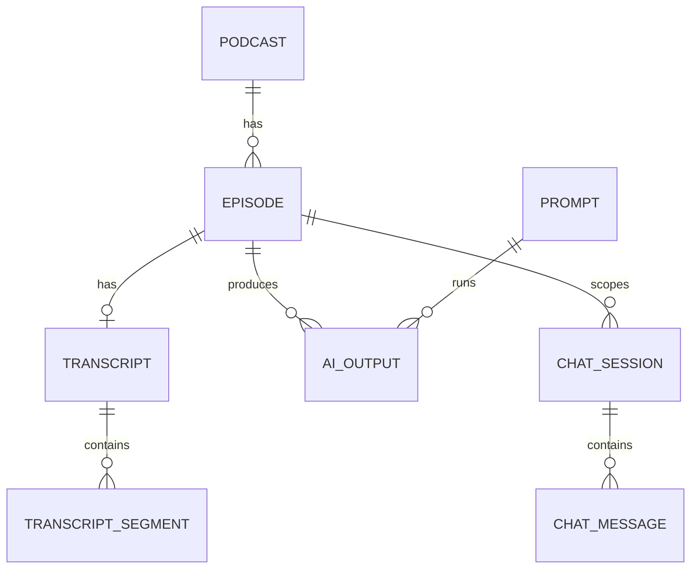

# PRD — Podcast Transcript Studio

> Status: Draft · Owner: Sten Hougaard · Last updated: 2026-07-12

---

## PRD-SEC-001 · Overview & Objectives

Podcast Transcript Studio er en lokal SwiftUI macOS-app til at hente, gemme, læse, kopiere og arbejde med Apple Podcasts-transskriptioner. Appen er bygget til en personlig power-user, der vil kunne indsætte et Apple Podcasts episode-link, hente Apples eksisterende transcript, gemme det lokalt, og bruge LLM-baserede prompts til at lave chat, noter, LinkedIn-opslag, SRT-output og andre genbrugelige formater.

Appen skal være lokal-first, BYOK og uden login. Markdown er appens native interne tekstformat, og alt indhold i appen skal kunne kopieres både i visningsvenlig form og som rå Markdown.

**Problem statement:** Apple Podcasts gør transcripts synlige, men det er besværligt at hente, kopiere, genbruge, eksportere og arbejde videre med dem i egne workflows.

**Primary objective:** Byg en lokal macOS-app, der gør Apple Podcasts-transskriptioner praktisk brugbare som et personligt knowledge- og content-værktøj.

**Success metrics:**
- En bruger kan indsætte et Apple Podcasts-link og få episode, metadata og transcript ind i appen.
- En hentet transcript cachelagres, så samme episode ikke skal hentes igen.
- Brugeren kan skifte mellem læsevenlig transcript-visning og tidskodet transcript-visning.
- Brugeren kan kopiere alle relevante data som visningsvenlig tekst og rå Markdown.
- Brugeren kan oprette eller redigere prompts som `.md`-filer i en folder, og appen opdager ændringer automatisk.
- Brugeren kan chatte med både aktuel episode og hele det lokale arkiv.
- Brugeren kan eksportere/importere sine data uden cloud-sync.

---

## PRD-SEC-002 · Target Audience

- **Primary user:** Sten som personlig power-user, der lytter til podcasts og vil genbruge transcripts til research, noter, content og chat.
- **Secondary user(s):** Andre macOS power-users, podcast-researchere, creators, konsulenter og marketingfolk, hvis appen senere distribueres.
- **Key user problems:**
  - Det er for besværligt at kopiere hele transcripts fra Apple Podcasts.
  - Transcripts skal kunne genbruges i Markdown, ikke kun læses i en lukket app.
  - AI-workflows skal kunne gentages via egne prompts og foretrukne LLM'er.
  - Tidligere episoder, outputs og chats skal kunne findes og bruges igen.

---

## PRD-SEC-003 · Core Features

### PRD-FEAT-001 · Episode Library
- **Description:** Appen åbner på et episodebibliotek, der viser tidligere indlæste episoder med metadata, status og artwork.
- **Priority:** Must-have for v1
- **Acceptance criteria:**
  - [ ] Biblioteket viser alle lokalt gemte episoder.
  - [ ] Hver episode viser mindst episodetitel, podcastnavn, dato, transcript-status og sidst opdateret.
  - [ ] Artwork vises, hvis det kan hentes fra metadata.
  - [ ] Biblioteket understøtter søgning i titel, podcastnavn, transcript og gemte AI-output.
  - [ ] Biblioteket understøtter sortering efter senest indlæst, senest brugt, podcast og status.
- **Sub-tasks:**
  - `PRD-FEAT-001.1` — Byg episode list/grid UI i SwiftUI.
  - `PRD-FEAT-001.2` — Tilføj søgning og sortering.
  - `PRD-FEAT-001.3` — Vis statusbadges for transcript og AI-output.

### PRD-FEAT-002 · Apple Podcasts Link Import
- **Description:** Brugeren kan indsætte et Apple Podcasts episode-link. Appen parser podcast-id, episode-id og relevante URL-parametre.
- **Priority:** Must-have for v1
- **Acceptance criteria:**
  - [ ] Brugeren kan indsætte et Apple Podcasts-link som `https://podcasts.apple.com/dk/podcast/.../id1693194266?l=da&i=1000775594125`.
  - [ ] Appen udleder podcast-id og episode-id, når de findes i URL'en.
  - [ ] Appen gemmer original URL og normaliseret metadata i SQLite.
  - [ ] Ugyldige links giver en forståelig fejl uden at crashe.
- **Sub-tasks:**
  - `PRD-FEAT-002.1` — Implementer URL-parser.
  - `PRD-FEAT-002.2` — Implementer validering og fejlbeskeder.

### PRD-FEAT-003 · Apple Transcript Retrieval
- **Description:** Appen forsøger at hente Apples eksisterende transcript for episoden og gemmer resultatet lokalt.
- **Priority:** Must-have for v1
- **Acceptance criteria:**
  - [ ] Appen forsøger at hente transcript uden at kræve manuel copy/paste.
  - [ ] Hvis transcript findes, gemmes det i SQLite i både struktureret form og Markdown-form.
  - [ ] Hvis transcript ikke findes eller ikke kan hentes, markeres episoden som fejlet.
  - [ ] Fejlede episoder viser en `Prøv nu` / `Indlæs igen`-knap.
  - [ ] `Indlæs igen` tvinger en ny hentning og opdaterer den lokale cache.
- **Sub-tasks:**
  - `PRD-FEAT-003.1` — Undersøg lokal Apple Podcasts transcript-cache på macOS.
  - `PRD-FEAT-003.2` — Implementer integrationslag, så transcript-kilde kan udskiftes senere.
  - `PRD-FEAT-003.3` — Implementer retry/status-flow.

### PRD-FEAT-004 · Transcript Views
- **Description:** En episode har transcript-tabs for både læsevenlig tekst og tidskodet transcript-liste.
- **Priority:** Must-have for v1
- **Acceptance criteria:**
  - [ ] Episodevisningen har tabs for `Tekst` og `Tidskoder`.
  - [ ] `Tekst` viser transcriptet i læsevenlig form.
  - [ ] `Tidskoder` viser transcriptet som segmenter med timestamps.
  - [ ] Brugeren kan markere tekst eller segmenter.
  - [ ] Begge tabs understøtter kopiering som formateret tekst og rå Markdown.
- **Sub-tasks:**
  - `PRD-FEAT-004.1` — Definer transcript Markdown-format.
  - `PRD-FEAT-004.2` — Definer tidskodet segmentmodel.
  - `PRD-FEAT-004.3` — Implementer copy actions på selection og hele transcriptet.

### PRD-FEAT-005 · Copy-Everything Principle
- **Description:** Alt brugerrelevant indhold i appen skal kunne kopieres i både visningsvenlig form og rå Markdown.
- **Priority:** Must-have for v1
- **Acceptance criteria:**
  - [ ] Transcripts kan kopieres som formateret tekst.
  - [ ] Transcripts kan kopieres som rå Markdown.
  - [ ] AI-output kan kopieres som formateret tekst og rå Markdown.
  - [ ] Chat-svar kan kopieres som formateret tekst og rå Markdown.
  - [ ] Metadata kan kopieres som Markdown.
  - [ ] Copy-menuer er konsistente på tværs af appen.
- **Sub-tasks:**
  - `PRD-FEAT-005.1` — Byg fælles copy-action komponent.
  - `PRD-FEAT-005.2` — Definer Markdown serializer for alle relevante data.

### PRD-FEAT-006 · Prompt Folder System
- **Description:** Appen opretter en lokal prompt-folder ved første start og loader prompts som `.md`-filer med frontmatter.
- **Priority:** Must-have for v1
- **Acceptance criteria:**
  - [ ] Første start opretter en standard prompt-folder.
  - [ ] Appen lægger 5-10 default prompts i folderen.
  - [ ] Hver prompt er en `.md`-fil med YAML frontmatter.
  - [ ] Nye `.md`-filer i folderen bliver automatisk til handlinger i appen.
  - [ ] Ændringer i prompt-folderen opdages løbende.
- **Sub-tasks:**
  - `PRD-FEAT-006.1` — Definer prompt frontmatter schema.
  - `PRD-FEAT-006.2` — Implementer folder creation og default prompt seeding.
  - `PRD-FEAT-006.3` — Implementer file watcher.

### PRD-FEAT-007 · Prompt Validation and Fix Flow
- **Description:** Appen advarer om ugyldige prompts og hjælper brugeren med at rette dem.
- **Priority:** Must-have for v1
- **Acceptance criteria:**
  - [ ] Appen markerer prompts med manglende eller ugyldig frontmatter.
  - [ ] Brugeren får beskeden: "En ny prompt er set, den er ikke som forventet - vil du have hjælp til at få den fixet?"
  - [ ] Fix-flowet foreslår manglende metadata.
  - [ ] Brugeren kan gemme en rettet prompt tilbage til filen.
  - [ ] En rettet prompt bliver straks tilgængelig som app-handling.
- **Sub-tasks:**
  - `PRD-FEAT-007.1` — Byg prompt validator.
  - `PRD-FEAT-007.2` — Byg guided repair UI.

### PRD-FEAT-008 · LLM Settings and Provider Selection
- **Description:** Settings indeholder konfiguration for OpenAI/API-baserede providers, Apple Intelligence/Foundation Models og lokal Ollama.
- **Priority:** Must-have for v1
- **Acceptance criteria:**
  - [ ] Brugeren kan indtaste API key og model for API-baserede providers.
  - [ ] API keys gemmes i macOS Keychain.
  - [ ] Appen kan opdage eller teste en lokal Ollama-server.
  - [ ] Appen kan bruge Apple Intelligence via Foundation Models, når det er tilgængeligt på brugerens macOS.
  - [ ] Brugeren kan vælge default provider/model.
- **Sub-tasks:**
  - `PRD-FEAT-008.1` — Definer provider protocol.
  - `PRD-FEAT-008.2` — Implementer OpenAI-kompatibel provider.
  - `PRD-FEAT-008.3` — Implementer Ollama provider via lokal HTTP.
  - `PRD-FEAT-008.4` — Implementer Apple Foundation Models provider, når platformen understøtter det.

### PRD-FEAT-009 · Prompt Execution with Preferred LLM Override
- **Description:** Hver prompt kan angive foretrukken provider/model i frontmatter, men brugeren kan overrule ved kørsel.
- **Priority:** Must-have for v1
- **Acceptance criteria:**
  - [ ] Prompt frontmatter kan angive `version`, `preferredProvider`, `preferredModel`, `title`, `description` og `outputType`.
  - [ ] Appen viser promptens foretrukne LLM ved kørsel.
  - [ ] Brugeren kan vælge en anden provider/model før kørsel.
  - [ ] Den faktisk valgte provider/model gemmes sammen med output.
- **Sub-tasks:**
  - `PRD-FEAT-009.1` — Byg prompt execution sheet.
  - `PRD-FEAT-009.2` — Gem execution metadata i SQLite.

### PRD-FEAT-010 · Automatic AI Output History
- **Description:** Alle prompt-kørsler gemmes automatisk som historik.
- **Priority:** Must-have for v1
- **Acceptance criteria:**
  - [ ] Hver prompt-kørsel gemmer inputreference, prompt-id/version, provider, model, output, tidspunkt og episode-scope.
  - [ ] Outputs vises på episodevisningen.
  - [ ] Outputs kan søges fra episodebiblioteket.
  - [ ] Outputs kan kopieres som formateret tekst og rå Markdown.
- **Sub-tasks:**
  - `PRD-FEAT-010.1` — Implementer output database model.
  - `PRD-FEAT-010.2` — Implementer output history UI.

### PRD-FEAT-011 · Chat with Episode and Archive
- **Description:** Chatten kan bruge enten aktuel episode eller hele det lokale arkiv som kontekst.
- **Priority:** Must-have for v1
- **Acceptance criteria:**
  - [ ] Brugeren kan vælge chat-scope: `Aktuel episode` eller `Hele arkivet`.
  - [ ] Chat UI viser tydeligt aktivt scope.
  - [ ] Chatten kan bruge transcript og tidligere AI-output som kontekst.
  - [ ] Chat-svar gemmes automatisk.
  - [ ] Chat-svar kan kopieres som formateret tekst og rå Markdown.
- **Sub-tasks:**
  - `PRD-FEAT-011.1` — Byg chat UI.
  - `PRD-FEAT-011.2` — Definer context retrieval for episode-scope.
  - `PRD-FEAT-011.3` — Definer context retrieval for archive-scope.

### PRD-FEAT-012 · Export and Import
- **Description:** Appen kan eksportere og importere både enkeltdata og hele appens lokale data.
- **Priority:** Must-have for v1
- **Acceptance criteria:**
  - [ ] Brugeren kan eksportere et enkelt transcript som Markdown.
  - [ ] Brugeren kan eksportere et enkelt AI-output som Markdown.
  - [ ] Brugeren kan eksportere transcript som `.srt`, når tidskoder findes.
  - [ ] Brugeren kan batch-eksportere alle transcripts som Markdown.
  - [ ] Brugeren kan lave en samlet backup-pakke med SQLite-data og prompts.
  - [ ] Import kan gendanne eller merge en tidligere export.
  - [ ] API keys eksporteres ikke som standard.
- **Sub-tasks:**
  - `PRD-FEAT-012.1` — Definer export package format.
  - `PRD-FEAT-012.2` — Implementer single export.
  - `PRD-FEAT-012.3` — Implementer batch export.
  - `PRD-FEAT-012.4` — Implementer import/merge flow.

### PRD-FEAT-013 · Apple Podcasts and Browser Actions
- **Description:** Episodevisningen har handlinger til at åbne i Podcasts, subscribe og lave Google-søgning.
- **Priority:** Must-have for v1
- **Acceptance criteria:**
  - [ ] `Åbn i Podcasts` åbner episoden i Apple Podcasts.
  - [ ] Hvis brugeren har markeret et tidskodet område, spørger appen: "Åben ved valgte sted? eller fra start?"
  - [ ] `Subscribe` forsøger at åbne podcast-serien i Apple Podcasts.
  - [ ] `Lav Google-søgning` åbner browseren med podcasttitel og/eller episodetitel udfyldt.
- **Sub-tasks:**
  - `PRD-FEAT-013.1` — Implementer Apple Podcasts deep link handling.
  - `PRD-FEAT-013.2` — Implementer selection-aware open action.
  - `PRD-FEAT-013.3` — Implementer Google search URL builder.

### PRD-FEAT-014 · Metadata Capture
- **Description:** Appen gemmer og viser relevante metadata for podcast, episode, transcript og handlinger.
- **Priority:** Must-have for v1
- **Acceptance criteria:**
  - [ ] Appen gemmer podcastnavn, episodetitel, dato, episode-id/link, podcast-id/link og artwork URL, når tilgængeligt.
  - [ ] Appen gemmer transcript-status, sidst hentet og sidst forsøgt.
  - [ ] Appen gemmer varighed, publisher og beskrivelse, når tilgængeligt.
  - [ ] Metadata kan kopieres som Markdown.
- **Sub-tasks:**
  - `PRD-FEAT-014.1` — Definer metadata model.
  - `PRD-FEAT-014.2` — Implementer metadata panel.

---

## PRD-SEC-004 · Technical Stack Recommendations

| Layer | Recommendation | Rationale |
|-------|----------------|-----------|
| App UI | SwiftUI for macOS | Native macOS UX, god integration med systemfunktioner, Keychain, file watching og Apple frameworks. |
| App architecture | Local-first MVVM eller reducer-baseret state model | Appen har flere synkroniserede views: library, transcript, prompts, chat og settings. |
| Backend | Ingen backend i v1 | BYOK, lokal-first og ingen login reducerer kompleksitet. |
| Database | SQLite | Velegnet til lokal cache, søgning, metadata, outputs, chats og import/export. |
| Full-text search | SQLite FTS5 | Gør det muligt at søge i transcripts, outputs og chat lokalt. |
| Prompt storage | Lokal folder med Markdown-filer og YAML frontmatter | Gør prompts redigerbare uden for appen og versionerbare. |
| Secrets | macOS Keychain | API keys bør ikke gemmes i SQLite som almindelig tekst. |
| LLM providers | Provider abstraction for OpenAI-kompatibel API, Ollama og Apple Foundation Models | Hver prompt kan have foretrukken LLM, og brugeren kan overrule. |
| Apple Intelligence | Foundation Models framework, hvor tilgængeligt | Apple beskriver Foundation Models som native Swift-adgang til Apple Intelligence-modeller. |
| Ollama | Lokal HTTP API på `localhost:11434` som default | Ollama dokumenterer lokal API-adgang og kræver typisk ikke auth lokalt. |
| Hosting | Ikke relevant for v1 | Appen er lokal macOS-app. |
| Auth | Ingen login i v1 | Personlig lokal app. App-lås noteres som fremtidig fase. |

**Referenced documentation:**
- Apple Podcasts transcripts: https://podcasters.apple.com/support/5316-transcripts-on-apple-podcasts
- Apple Foundation Models: https://developer.apple.com/documentation/foundationmodels
- Ollama API: https://docs.ollama.com/api/introduction

---

## PRD-SEC-005 · Conceptual Data Model

### Entity: Podcast
| Field | Type | Notes |
|-------|------|-------|
| id | text | Local UUID or deterministic ID |
| apple_podcast_id | text nullable | Parsed from Apple URL when available |
| title | text | Podcast name |
| publisher | text nullable | Publisher/author |
| apple_url | text nullable | Series URL |
| artwork_url | text nullable | Cover image URL |
| subscribed_locally | boolean | Whether user marked it subscribed/opened subscribe action |
| created_at | datetime | Local creation timestamp |
| updated_at | datetime | Local update timestamp |

### Entity: Episode
| Field | Type | Notes |
|-------|------|-------|
| id | text | Local UUID |
| podcast_id | text | FK to Podcast |
| apple_episode_id | text nullable | Parsed from `i=` parameter when available |
| title | text | Episode title |
| description_md | text nullable | Episode description as Markdown |
| published_at | datetime nullable | Episode date |
| duration_seconds | integer nullable | Duration, if available |
| apple_url | text | Original Apple Podcasts URL |
| artwork_url | text nullable | Episode or podcast artwork |
| transcript_status | text | `not_loaded`, `loaded`, `failed`, `not_found`, `refreshing` |
| transcript_last_loaded_at | datetime nullable | Last successful load |
| transcript_last_attempted_at | datetime nullable | Last attempt |
| transcript_error | text nullable | Last error summary |
| created_at | datetime | Local creation timestamp |
| updated_at | datetime | Local update timestamp |

### Entity: Transcript
| Field | Type | Notes |
|-------|------|-------|
| id | text | Local UUID |
| episode_id | text | FK to Episode |
| source | text | `apple` for v1 |
| language_code | text nullable | Example: `da`, `en` |
| markdown | text | Native internal transcript form |
| plain_text | text | Search/copy convenience |
| raw_payload_json | text nullable | Optional debugging/source payload |
| created_at | datetime | Local creation timestamp |
| updated_at | datetime | Local update timestamp |

### Entity: TranscriptSegment
| Field | Type | Notes |
|-------|------|-------|
| id | text | Local UUID |
| transcript_id | text | FK to Transcript |
| start_ms | integer nullable | Start timestamp |
| end_ms | integer nullable | End timestamp |
| text | text | Segment text |
| markdown | text | Segment Markdown |
| sequence_index | integer | Stable order |

### Entity: Prompt
| Field | Type | Notes |
|-------|------|-------|
| id | text | Stable prompt ID from frontmatter or file path hash |
| file_path | text | Absolute or app-relative path |
| title | text | From frontmatter |
| description | text nullable | From frontmatter |
| version | text | From frontmatter |
| preferred_provider | text nullable | Example: `openai`, `ollama`, `apple` |
| preferred_model | text nullable | Example: model name |
| output_type | text nullable | Example: `markdown`, `srt`, `chat`, `post` |
| body_markdown | text | Prompt body |
| validation_status | text | `valid`, `warning`, `invalid` |
| validation_message | text nullable | Human-readable issue |
| file_modified_at | datetime | Last file timestamp |

### Entity: LLMProviderConfig
| Field | Type | Notes |
|-------|------|-------|
| id | text | Provider config ID |
| provider_type | text | `openai_compatible`, `ollama`, `apple_foundation_models` |
| display_name | text | User-facing name |
| base_url | text nullable | For API/Ollama providers |
| default_model | text nullable | Default model |
| api_key_keychain_ref | text nullable | Reference to Keychain item |
| is_enabled | boolean | Whether available in UI |
| created_at | datetime | Local creation timestamp |
| updated_at | datetime | Local update timestamp |

### Entity: AIOutput
| Field | Type | Notes |
|-------|------|-------|
| id | text | Local UUID |
| episode_id | text nullable | FK to Episode when scoped |
| prompt_id | text nullable | FK to Prompt |
| prompt_version | text nullable | Version used at run time |
| provider_type | text | Actual provider used |
| model | text | Actual model used |
| input_scope | text | `episode`, `archive`, `selection` |
| input_reference_json | text | References transcript/segments/history used |
| output_markdown | text | Native output |
| created_at | datetime | Run timestamp |

### Entity: ChatSession
| Field | Type | Notes |
|-------|------|-------|
| id | text | Local UUID |
| scope | text | `episode` or `archive` |
| episode_id | text nullable | Required for episode-scoped chat |
| title | text nullable | Optional session title |
| provider_type | text | Provider used by default |
| model | text | Model used by default |
| created_at | datetime | Local creation timestamp |
| updated_at | datetime | Local update timestamp |

### Entity: ChatMessage
| Field | Type | Notes |
|-------|------|-------|
| id | text | Local UUID |
| chat_session_id | text | FK to ChatSession |
| role | text | `user`, `assistant`, `system` |
| content_markdown | text | Native message body |
| provider_type | text nullable | For assistant messages |
| model | text nullable | For assistant messages |
| created_at | datetime | Message timestamp |

**Relationships:**
- Podcast 1—* Episode
- Episode 1—1 Transcript
- Transcript 1—* TranscriptSegment
- Episode 1—* AIOutput
- Prompt 1—* AIOutput
- Episode 1—* ChatSession
- ChatSession 1—* ChatMessage

---

## PRD-SEC-006 · UI Design Principles

- **Look & feel:** Native macOS, rolig, effektiv og bibliotek-orienteret. Appen skal føles som et personligt research- og produktivitetsværktøj, ikke som en marketing-side.
- **Key screens / flows:**
  - Episode Library som landing page.
  - Indsæt Apple Podcasts-link flow.
  - Episode detail view med metadata, actions, transcript tabs og AI-output.
  - Transcript tabs: `Tekst` og `Tidskoder`.
  - Prompt actions panel bygget dynamisk fra prompt-folderen.
  - Chat view med scope switch: `Aktuel episode` / `Hele arkivet`.
  - Settings for LLM providers, prompt-folder og export/import.
  - Prompt warning/fix flow.
- **Accessibility & responsiveness notes:**
  - Appen skal understøtte keyboard navigation for copy, search, tabs og prompt actions.
  - Copy actions skal være tilgængelige i både toolbar, context menu og keyboard shortcuts.
  - Fejlstatus skal være tekstlig, ikke kun farvebaseret.
  - Lange transcripts og outputs skal virtualiseres eller lazy-loades, så UI ikke fryser.

---

## PRD-SEC-007 · Security Considerations

- **Authentication:** Ingen login i v1. Appen er en lokal personlig macOS-app.
- **Authorization / roles:** Ingen roller i v1.
- **Data protection at rest:**
  - SQLite database gemmes lokalt i appens Application Support-folder.
  - API keys gemmes i macOS Keychain.
  - Export inkluderer ikke API keys som standard.
- **Data protection in transit:**
  - API-baserede LLM-kald sendes til den valgte provider.
  - Ollama-kald går lokalt til `localhost`, når lokal Ollama bruges.
  - Apple Foundation Models bør foretrækkes for private/offline workflows, når tilgængeligt.
- **Privacy / compliance:**
  - Appen skal tydeligt vise, hvilken LLM-provider der bruges ved prompt-kørsel og chat.
  - Brugeren skal kunne vælge lokal/Apple/Ollama frem for cloud-LLM for privat materiale.
  - Ingen cloud-sync eller app-backend i v1.
- **Future security improvements:**
  - App-lås med Touch ID/password.
  - Krypteret export.
  - Per-provider privacy labels i UI.

---

## PRD-SEC-008 · Development Phases

Alle nedenstående faser er del af v1-produktet. Faseopdelingen er til udviklingsplanlægning, ikke til at skære funktioner ud af v1.

| Phase | Scope | Features | Goal |
|-------|-------|----------|------|
| v1.1 Foundation | Lokal app-shell, SQLite, episode library, link import, metadata | PRD-FEAT-001, PRD-FEAT-002, PRD-FEAT-014 | Brugeren kan importere og se episoder i biblioteket. |
| v1.2 Transcript Core | Apple transcript-hentning, caching, retry, transcript tabs | PRD-FEAT-003, PRD-FEAT-004, PRD-FEAT-005 | Brugeren kan hente, læse og kopiere transcripts. |
| v1.3 Prompt System | Prompt folder, default prompts, file watcher, validation/fix flow | PRD-FEAT-006, PRD-FEAT-007 | Prompts bliver dynamiske app-funktioner. |
| v1.4 LLM Execution | Settings, providers, prompt execution, automatic output history | PRD-FEAT-008, PRD-FEAT-009, PRD-FEAT-010 | Brugeren kan køre prompts med valgfri LLM og gemme outputs automatisk. |
| v1.5 Chat and Archive | Chat med episode og hele arkivet | PRD-FEAT-011 | Brugeren kan spørge både aktuel episode og samlet historik. |
| v1.6 Export, Import and External Actions | Single/batch export, import, SRT, Apple Podcasts/browser actions | PRD-FEAT-012, PRD-FEAT-013 | Brugeren kan få data ud/ind og hoppe tilbage til Podcasts/browser. |

---

## PRD-SEC-009 · Challenges & Solutions

| Challenge | Impact | Proposed solution |
|-----------|--------|-------------------|
| Apple Podcasts transcripts ser ikke ud til at være en garanteret offentlig tredjeparts-API | Transcript-hentning kan være skrøbelig eller ændre sig | Isoler transcript-kilde bag et `TranscriptProvider` interface. Start med Apple-first lokal metode, og dokumenter fallback-muligheder senere. |
| Apples brugerflade begrænser officiel kopiering af transcript-tekst | Appens hovedværdi afhænger af at kunne få hele transcriptet | Undersøg lokal transcript-cache på macOS og bygg hentningen som en tydeligt markeret integrationsrisiko. |
| Apple Foundation Models kræver nyere macOS/hardware | Ikke alle brugere kan bruge Apple Intelligence-provider | Gør Apple-provider optional og vis tilgængelighedsstatus i Settings. |
| LLM-provideres output og capabilities varierer | Prompts kan virke forskelligt på OpenAI, Apple og Ollama | Gem preferred provider/model i frontmatter, men tillad runtime override. |
| Arkiv-chat kan kræve mange tokens | Cloud-kald kan blive dyre eller langsomme | Brug lokal søgning/FTS og senere embeddings til at vælge relevant kontekst før LLM-kald. |
| Markdown som native format kan miste strukturerede timestamps, hvis det bruges alene | SRT og tidskodet visning kræver segmentdata | Gem både Markdown og strukturerede `TranscriptSegment` records. |
| Import/merge kan skabe dubletter | Backup restore kan give uklart bibliotek | Brug Apple episode-id, podcast-id og URL som dedupe keys. Vis merge preview før import. |
| Prompt-folder kan indeholde ugyldige filer | Dynamiske app-funktioner kan fejle | Validator og fix-flow hjælper brugeren med at rette frontmatter. |

---

## PRD-SEC-010 · Future Expansions

- Audio fallback med egen transskription, fx Whisper eller anden speech-to-text, når Apple transcript ikke findes.
- Søgning direkte i Apple Podcasts-kataloget i stedet for kun link-import.
- Touch ID/password app-lås.
- Krypteret backup/export.
- Cloud-sync som valgfri funktion.
- Embeddings-baseret semantisk søgning på tværs af hele arkivet.
- Speaker detection eller speaker labeling, hvis transcript-kilden understøtter det.
- Delbare prompt-pakker.
- Plugin-system for flere podcastkilder.
- Menubar quick capture til Apple Podcasts-links.

---

## Open questions

- Hvad skal appens endelige navn være?
- Hvor skal standard prompt-folderen ligge: Application Support, Documents eller en bruger-valgt folder?
- Skal default prompts være på dansk, engelsk eller begge dele?
- Skal import merge være standard, eller skal import som standard oprette et separat bibliotek først?
- Skal `.srt` genereres fra alle segmenter automatisk, eller kun fra markerede dele, når der er en selection?

